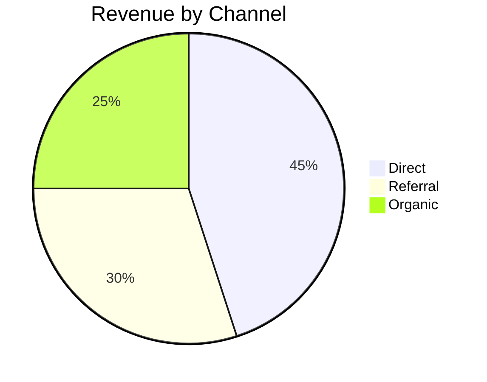

# Markdown Canvas Migration

> **For Claude:** REQUIRED SUB-SKILL: Use superpowers:executing-plans to implement this plan task-by-task.

**Goal:** Replace the TSX/react-runner canvas with a markdown renderer that streams, applies brand styling via CSS, supports Mermaid diagrams, and exports to PDF.

**Architecture:** Agent writes plain markdown via `write_canvas`/`patch_canvas`. Frontend renders it with `react-markdown` + `remark-gfm` inside a same-origin iframe. Brand colors/fonts are injected as a CSS stylesheet in the iframe. Logo auto-injected at top. Mermaid fenced blocks rendered client-side.

**Tech Stack:** react-markdown (already installed), remark-gfm (already installed), mermaid (new dep), existing iframe + print PDF approach.

---

### Task 1: Install mermaid, remove react-runner and recharts

**Files:**
- Modify: `apps/desktop/package.json`

**Step 1: Add mermaid, remove react-runner and recharts**

```bash
cd apps/desktop && pnpm remove react-runner recharts && pnpm add mermaid
```

**Step 2: Verify install**

```bash
pnpm ls mermaid react-markdown remark-gfm
```

Expected: mermaid listed, react-runner and recharts gone.

**Step 3: Commit**

```bash
git add apps/desktop/package.json pnpm-lock.yaml
git commit -m "deps: swap react-runner/recharts for mermaid in canvas"
```

---

### Task 2: Replace canvas-scope.ts with buildBrandCSS helper

**Files:**
- Delete: `apps/desktop/src/lib/canvas-scope.ts`
- Create: `apps/desktop/src/lib/canvas-brand.ts`

**Step 1: Create `canvas-brand.ts`**

This replaces the entire react-runner scope with a plain CSS string generator.

```ts
// canvas-brand.ts — generates branded CSS for the markdown canvas iframe.

import type { AgentSettings } from '@coagent/shared'

export interface BrandValues {
  name: string
  logoUrl: string
  primary: string
  secondary: string
  tertiary: string
  fontHeading: string
  fontBody: string
}

export function brandFromSettings(settings: AgentSettings | null | undefined): BrandValues {
  return {
    name: settings?.brand_company || settings?.name || '',
    logoUrl: settings?.brand_logo || '',
    primary: settings?.brand_primary || '#1a2744',
    secondary: settings?.brand_secondary || '#6b7280',
    tertiary: settings?.brand_tertiary || '#e11d48',
    fontHeading: 'system-ui, -apple-system, sans-serif',
    fontBody: 'system-ui, -apple-system, sans-serif',
  }
}

export function buildBrandCSS(brand: BrandValues): string {
  return `
    html, body { margin: 0; padding: 0; background: white; }
    body {
      font-family: ${brand.fontBody};
      color: #1a1a1a;
      font-size: 15px;
      line-height: 1.7;
    }

    /* Container */
    .canvas-root {
      max-width: 720px;
      margin: 0 auto;
      padding: 48px;
    }

    /* Logo header */
    .canvas-logo {
      margin-bottom: 32px;
    }
    .canvas-logo img {
      max-height: 48px;
      object-fit: contain;
    }
    .canvas-logo-text {
      font-family: ${brand.fontHeading};
      font-weight: 700;
      font-size: 20px;
      color: ${brand.primary};
    }

    /* Typography */
    h1, h2, h3, h4, h5, h6 {
      font-family: ${brand.fontHeading};
      color: ${brand.primary};
      font-weight: 600;
      margin-top: 1.5em;
      margin-bottom: 0.5em;
      line-height: 1.3;
    }
    h1 { font-size: 28px; }
    h2 { font-size: 22px; }
    h3 { font-size: 18px; }
    h1:first-child, h2:first-child, h3:first-child { margin-top: 0; }

    p { margin: 0 0 1em; }

    strong { color: #111; }

    a { color: ${brand.primary}; text-decoration: underline; }

    blockquote {
      border-left: 3px solid ${brand.primary};
      margin: 1em 0;
      padding: 0.5em 1em;
      color: #555;
      background: #f9f9f9;
    }

    hr {
      border: none;
      border-top: 2px solid ${brand.primary};
      margin: 2em 0;
    }

    /* Tables */
    table {
      width: 100%;
      border-collapse: collapse;
      margin: 1em 0;
      font-size: 14px;
    }
    thead th {
      background: ${brand.primary};
      color: white;
      text-align: left;
      padding: 8px 12px;
      font-weight: 600;
      font-size: 11px;
      text-transform: uppercase;
      letter-spacing: 0.05em;
    }
    tbody td {
      padding: 8px 12px;
      border-bottom: 1px solid #eee;
    }
    tbody tr:last-child td { border-bottom: none; }

    /* Lists */
    ul, ol { margin: 0 0 1em; padding-left: 1.5em; }
    li { margin-bottom: 0.3em; }

    /* Code */
    code {
      background: #f3f4f6;
      padding: 2px 5px;
      border-radius: 3px;
      font-size: 13px;
      font-family: 'SF Mono', 'Fira Code', monospace;
    }
    pre {
      background: #f3f4f6;
      padding: 16px;
      border-radius: 6px;
      overflow-x: auto;
      margin: 1em 0;
    }
    pre code { background: none; padding: 0; }

    /* Mermaid */
    .mermaid { margin: 1.5em 0; text-align: center; }

    /* Print */
    @media print {
      html, body { background: white; }
      .canvas-root { padding: 0; max-width: none; }
    }
  `
}
```

**Step 2: Delete `canvas-scope.ts`**

```bash
rm apps/desktop/src/lib/canvas-scope.ts
```

**Step 3: Delete `vendor/tailwind-play.js`**

```bash
rm apps/desktop/src/vendor/tailwind-play.js
```

**Step 4: Commit**

```bash
git add -A apps/desktop/src/lib/canvas-scope.ts apps/desktop/src/lib/canvas-brand.ts apps/desktop/src/vendor/
git commit -m "feat(canvas): replace react-runner scope with branded CSS helper"
```

---

### Task 3: Rewrite CanvasPane.tsx for markdown rendering

**Files:**
- Rewrite: `apps/desktop/src/components/CanvasPane.tsx`

**Step 1: Rewrite the component**

Replace the entire file. The new version:
- Renders markdown to HTML using `react-markdown` + `remark-gfm`
- Renders into an iframe via `srcdoc` (updated on every code/streaming change)
- Injects branded CSS from `buildBrandCSS`
- Auto-injects logo at the top
- Initializes Mermaid on ` ```mermaid ` blocks after render
- Handles PDF export via `iframe.contentWindow.print()`

```tsx
// CanvasPane — renders a Canvas (markdown document) in a branded iframe.
//
// The agent writes markdown via write_canvas / patch_canvas. We render it
// with react-markdown + remark-gfm, inject branded CSS, and display inside
// a same-origin iframe for style isolation and PDF export (window.print).

import { useEffect, useMemo, useRef, useState, useCallback } from 'react'
import { X, Download, Loader2 } from 'lucide-react'
import ReactMarkdown from 'react-markdown'
import remarkGfm from 'remark-gfm'
import { renderToStaticMarkup } from 'react-dom/server'
import type { Canvas, AgentSettings } from '@coagent/shared'
import { buildBrandCSS, brandFromSettings } from '@/lib/canvas-brand'

interface Props {
  canvas: Canvas
  streaming?: boolean
  streamingCode?: string
  settings: AgentSettings | null | undefined
  onClose: () => void
}

// Debounce interval for streaming updates (ms)
const STREAM_DEBOUNCE_MS = 120

export function CanvasPane({ canvas, streaming = false, streamingCode, settings, onClose }: Props) {
  const iframeRef = useRef<HTMLIFrameElement>(null)
  const [debouncedCode, setDebouncedCode] = useState<string>(canvas.code || '')

  const brand = useMemo(() => brandFromSettings(settings), [
    settings?.brand_company,
    settings?.brand_logo,
    settings?.brand_primary,
    settings?.brand_secondary,
    settings?.brand_tertiary,
    settings?.name,
  ])

  const brandCSS = useMemo(() => buildBrandCSS(brand), [brand])

  // Debounce streaming code
  useEffect(() => {
    const source = streaming && streamingCode ? streamingCode : canvas.code || ''
    if (!streaming) {
      setDebouncedCode(source)
      return
    }
    const t = setTimeout(() => setDebouncedCode(source), STREAM_DEBOUNCE_MS)
    return () => clearTimeout(t)
  }, [streaming, streamingCode, canvas.code])

  // Render markdown to static HTML
  const markdownHtml = useMemo(() => {
    if (!debouncedCode.trim()) return ''
    try {
      return renderToStaticMarkup(
        <ReactMarkdown remarkPlugins={[remarkGfm]}>
          {debouncedCode}
        </ReactMarkdown>
      )
    } catch {
      return `<p>${debouncedCode}</p>`
    }
  }, [debouncedCode])

  // Build logo header HTML
  const logoHtml = useMemo(() => {
    if (!brand.name && !brand.logoUrl) return ''
    if (brand.logoUrl) {
      return `<div class="canvas-logo"></div>`
    }
    return `<div class="canvas-logo"><div class="canvas-logo-text">${brand.name}</div></div>`
  }, [brand.name, brand.logoUrl])

  // Build full iframe srcdoc
  const srcdoc = useMemo(() => {
    return `<!DOCTYPE html>
<html lang="en">
<head>
<meta charset="UTF-8">
<meta name="viewport" content="width=device-width, initial-scale=1.0">
<style>${brandCSS}</style>
</head>
<body>
<div class="canvas-root">
${logoHtml}
${markdownHtml}
</div>
<script>
// Initialize Mermaid diagrams if any exist
(function() {
  var els = document.querySelectorAll('code.language-mermaid');
  if (!els.length) return;
  var s = document.createElement('script');
  s.src = 'https://cdn.jsdelivr.net/npm/mermaid@11/dist/mermaid.min.js';
  s.onload = function() {
    els.forEach(function(el) {
      var pre = el.parentElement;
      var div = document.createElement('div');
      div.className = 'mermaid';
      div.textContent = el.textContent;
      pre.replaceWith(div);
    });
    mermaid.initialize({ startOnLoad: false, theme: 'neutral' });
    mermaid.run();
  };
  document.head.appendChild(s);
})();
</script>
</body>
</html>`
  }, [brandCSS, logoHtml, markdownHtml])

  const handleExportPdf = useCallback(() => {
    const iframe = iframeRef.current
    if (!iframe?.contentWindow) return
    try {
      iframe.contentWindow.focus()
      iframe.contentWindow.print()
    } catch (err) {
      console.error('[CanvasPane] print failed:', err)
    }
  }, [])

  return (
    <div className="flex flex-col h-full w-full max-w-[760px] border-l border-neutral-200 dark:border-neutral-800 bg-neutral-50 dark:bg-neutral-950 relative">
      {/* Toolbar */}
      <div className="flex items-center justify-between px-4 py-2.5 border-b border-neutral-200 dark:border-neutral-800 bg-white dark:bg-neutral-900 flex-shrink-0">
        <div className="flex items-center gap-2 min-w-0">
          {streaming && (
            <Loader2 size={13} className="animate-spin flex-shrink-0 text-neutral-400" />
          )}
          <div className="text-[12.5px] font-semibold text-neutral-800 dark:text-neutral-100 truncate">
            {canvas.title || 'Untitled'}
          </div>
          {streaming && (
            <div className="text-[10.5px] text-neutral-400 dark:text-neutral-500">drafting…</div>
          )}
        </div>
        <div className="flex items-center gap-1 flex-shrink-0">
          <button
            onClick={handleExportPdf}
            className="flex items-center gap-1.5 px-2.5 py-1 rounded-md text-[11.5px] font-medium text-neutral-600 dark:text-neutral-300 hover:bg-neutral-100 dark:hover:bg-neutral-800 transition-colors"
            title="Print / Save as PDF"
          >
            <Download size={12} />
            Export PDF
          </button>
          <button
            onClick={onClose}
            className="p-1 rounded-md text-neutral-500 dark:text-neutral-400 hover:bg-neutral-100 dark:hover:bg-neutral-800 transition-colors"
            title="Close canvas"
          >
            <X size={14} />
          </button>
        </div>
      </div>

      {/* Canvas surface */}
      <div className="flex-1 overflow-auto p-3">
        <iframe
          ref={iframeRef}
          srcDoc={srcdoc}
          sandbox="allow-same-origin allow-modals allow-scripts allow-popups"
          title={canvas.title || 'Canvas'}
          className="border-0 block bg-white shadow-sm rounded-md w-full min-h-full"
        />
        {!debouncedCode.trim() && !streaming && (
          <div className="absolute inset-0 flex items-center justify-center text-[13px] text-neutral-400 dark:text-neutral-500 pointer-events-none">
            Empty canvas
          </div>
        )}
      </div>
    </div>
  )
}
```

Key changes from the old version:
- No `react-runner`, no `useRunner`, no `createPortal`
- No `tailwind-play.js` — styles come from `buildBrandCSS`
- `srcdoc` is rebuilt on every markdown change (simple, no portal complexity)
- Mermaid loaded lazily from CDN only when ` ```mermaid ` blocks exist
- `sandbox` adds `allow-scripts` (needed for Mermaid) and `allow-popups` (needed for print)
- Logo auto-injected at top of every canvas

**Step 2: Commit**

```bash
git add apps/desktop/src/components/CanvasPane.tsx
git commit -m "feat(canvas): rewrite CanvasPane for markdown rendering"
```

---

### Task 4: Update agent tool definitions and handlers

**Files:**
- Modify: `packages/agent-core/src/agent.ts` (lines 478–524, 2224–2275)

**Step 1: Rewrite CANVAS_TOOLS array (lines 478–524)**

Replace the TSX-specific tool descriptions with markdown-focused ones. Keep the `code` field name for backward compatibility with storage and streaming.

```ts
const CANVAS_TOOLS: Anthropic.Tool[] = [
  {
    name: 'write_canvas',
    description: `Create a new canvas — a markdown document rendered live in the canvas pane with the user's brand styling. Use this for any document: proposals, reports, flyers, letters, invoices, one-pagers, dashboards.

Call skills(execute, 'canvas-design') first if you haven't this conversation to load the design patterns.

The code prop is a full markdown document using GFM (GitHub Flavored Markdown). You have:
- Standard markdown: headings, bold, italic, links, images
- GFM tables: | col1 | col2 | with alignment
- Mermaid diagrams: fenced code blocks with language "mermaid"
- Horizontal rules for section dividers

Rules:
- Write real content only — no {{placeholders}}, TBD, or "fill in later".
- Don't reference colors or fonts — branding is applied automatically by the renderer.
- Use tables for structured data (invoices, comparisons, schedules).
- Use Mermaid for flowcharts, timelines, pie charts, Gantt charts.
- Use --- for section dividers.`,
    input_schema: {
      type: 'object' as const,
      properties: {
        title: { type: 'string', description: 'Canvas title shown in the pane header.' },
        code: { type: 'string', description: 'Full markdown document. GFM syntax with optional Mermaid fenced blocks.' },
        kind: { type: 'string', description: 'Document archetype — e.g. "proposal", "flyer", "report", "letter", "invoice", "dashboard". Agent picks based on intent.' },
      },
      required: ['title', 'code'],
    },
  },
  {
    name: 'patch_canvas',
    description: `Replace the content of an existing canvas. The canvas pane will re-render the new markdown immediately.

Prefer patch_canvas over write_canvas when the user is iterating on an existing document ("change the title", "add a section", "update the numbers"). For structural rewrites, write the full new content.`,
    input_schema: {
      type: 'object' as const,
      properties: {
        canvas_id: { type: 'string', description: 'ID of the canvas to patch (from write_canvas response).' },
        code: { type: 'string', description: 'Full new markdown content. Replaces existing content entirely.' },
        title: { type: 'string', description: 'Optional new title.' },
      },
      required: ['canvas_id', 'code'],
    },
  },
]
```

**Step 2: Update the comment above CANVAS_TOOLS**

Change line 478–480 from:
```
// Canvas tools — always registered (non-heartbeat contexts only).
// The agent writes TSX that renders inside react-runner. Brand, charts, and
// icons are pre-injected via scope — see apps/desktop/src/lib/canvas-scope.ts.
```
To:
```
// Canvas tools — always registered (non-heartbeat contexts only).
// The agent writes markdown that renders inside a branded iframe.
```

**Step 3: No changes needed to handlers**

The `write_canvas` and `patch_canvas` handlers at lines 2224–2275 pass `input.code` directly to `createCanvas`/`updateCanvas` — they're content-agnostic and work with markdown as-is.

The streaming code (`extractPartialCode`, the Anthropic/OpenAI streaming guards) also extracts the `code` field regardless of content type — no changes needed.

**Step 4: Remove the system prompt canvas paragraph**

In `buildSystemPrompt` (around line 758), find the line referencing canvas tools:
```
- write_canvas / patch_canvas — create and iterate on live documents
```
This line is fine as-is — it doesn't mention TSX. Keep it.

**Step 5: Commit**

```bash
git add packages/agent-core/src/agent.ts
git commit -m "feat(canvas): update tool descriptions for markdown"
```

---

### Task 5: Rewrite canvas-design.md skill

**Files:**
- Rewrite: `packages/agent-core/skills/canvas-design.md`

**Step 1: Replace the skill file**

```markdown
# Canvas Design Skill

You are writing a Canvas — a markdown document rendered with the user's brand
styling. Read this file before calling `write_canvas`. The renderer applies
colors, fonts, and logo automatically — you just write clean markdown.

---

## 1. What You Have

The `code` argument to `write_canvas` is a full **GFM markdown** document:

- Standard markdown: headings, bold, italic, links, lists
- **GFM tables**: `| col | col |` with `---` alignment rows
- **Mermaid diagrams**: fenced code blocks with language `mermaid`
- Horizontal rules (`---`) for section dividers

**Nothing else.** No HTML tags, no JSX, no CSS, no inline styles.

### Branding

The renderer injects the user's brand automatically:
- Headings → brand primary color + brand font
- Table headers → brand primary background, white text
- Blockquote borders, horizontal rules, links → brand primary
- Logo → auto-injected at the top of every document

**Never reference colors, fonts, or the logo in your markdown.** Just write
the content — the styling layer handles the rest.

### Mermaid

Use fenced code blocks with language `mermaid` for diagrams:

~~~markdown

~~~

Supported diagram types: pie, flowchart, sequence, gantt, timeline, mindmap.

---

## 2. Document Recipes

### Invoice / Statement

```markdown
# Invoice #1032

**Date:** March 28, 2026

---

**From:** Your Company Name
**To:** ACME Corp — billing@acme.com

---

| Item | Qty | Rate | Amount |
|------|----:|-----:|-------:|
| Strategy consultation | 2 | $150 | $300 |
| Social media audit | 1 | $500 | $500 |

---

**Subtotal:** $800
**Total: $800**

*Payment due within 30 days.*
```

### Proposal / One-Pager

- Lead with a strong title and one-sentence hook
- Use a horizontal rule after the intro
- Problem/Solution in two short paragraphs
- KPIs as a table: Metric | Value | Note
- Close with a "Next Steps" section

### Report with Charts

- Use Mermaid pie/bar for data visualization
- Use tables for detailed data
- Keep charts simple — one chart per section

### Letter

- Short paragraphs with line breaks between them
- Date at the top
- Recipient block
- Close with a signature line (just the company name in bold)

---

## 3. Hard Rules

1. **Real content only.** No `{{placeholders}}`, TBD, lorem ipsum, or
   "fill in later." If you don't have the details, ask the user first.
2. **No HTML.** Write pure markdown. No `<div>`, `<span>`, `<style>`,
   `<script>`, or any HTML tags.
3. **No color/font references.** Don't write "in blue" or "use Arial."
   The brand styling is automatic.
4. **No image URLs.** The logo is auto-injected. If the user wants an
   image, tell them image embedding isn't supported yet.
5. **No ResponsiveContainer.** For Mermaid charts, keep them simple —
   complex nested charts don't render well.
6. **One document per request.** Never call `write_canvas` twice in
   one turn.
7. **Tables for structured data.** Use GFM tables for anything with
   columns — line items, comparisons, schedules, contact info.

---

## 4. Workflow

1. User asks for a document.
2. Think about which recipe fits (invoice / proposal / report / letter / custom).
3. Pull specifics from the conversation (names, numbers, dates, line items).
4. Call `write_canvas` with a full markdown document.
5. If the user asks for edits, call `patch_canvas` with the full updated
   markdown and the existing `canvas_id` (from the write_canvas response).

---

## 5. When NOT to Use a Canvas

- Plain chat answers ("what's the capital of France")
- Short lists or bullet points inside a chat response
- Code snippets the user is going to paste elsewhere
- Anything the user explicitly asks to be in the chat itself

Use a Canvas when the user says "make me a…", "draft a…", "write up a…",
"put together a…", or when they'd clearly want to export a PDF at the end.
```

**Step 2: Commit**

```bash
git add packages/agent-core/skills/canvas-design.md
git commit -m "feat(canvas): rewrite canvas-design skill for markdown"
```

---

### Task 6: Fix PDF export

**Files:**
- Modify: `apps/desktop/src/components/CanvasPane.tsx` (if needed)

**Step 1: Test PDF export**

Run `pnpm tauri dev`, create a canvas, click Export PDF. The iframe now has `sandbox="allow-same-origin allow-modals allow-scripts allow-popups"` which should allow `window.print()`.

**Step 2: If print() fails in Tauri webview**

Try the Tauri webview print API as a fallback. In `handleExportPdf`:

```ts
const handleExportPdf = useCallback(async () => {
  const iframe = iframeRef.current
  if (!iframe?.contentWindow) return
  try {
    iframe.contentWindow.focus()
    iframe.contentWindow.print()
  } catch (err) {
    console.error('[CanvasPane] iframe print failed, trying Tauri print:', err)
    // Fallback: open the content in a new window for printing
    const w = window.open('', '_blank')
    if (w) {
      w.document.write(srcdoc)
      w.document.close()
      w.focus()
      w.print()
    }
  }
}, [srcdoc])
```

**Step 3: If both fail, use Tauri dialog + file write**

As a last resort, render to a standalone HTML file and save via Tauri's save dialog:

```ts
import { save } from '@tauri-apps/plugin-dialog'
import { writeTextFile } from '@tauri-apps/plugin-fs'

// In handleExportPdf:
const path = await save({ defaultPath: `${canvas.title || 'document'}.html`, filters: [{ name: 'HTML', extensions: ['html'] }] })
if (path) await writeTextFile(path, srcdoc)
```

**Step 4: Commit once working**

```bash
git add apps/desktop/src/components/CanvasPane.tsx
git commit -m "fix(canvas): get PDF export working"
```

---

### Task 7: Cleanup — remove dead code and unused deps

**Files:**
- Verify and clean: `apps/desktop/src/lib/canvas-scope.ts` (should be deleted in Task 2)
- Verify and clean: `apps/desktop/src/vendor/tailwind-play.js` (should be deleted in Task 2)
- Verify: no remaining imports of `react-runner`, `canvas-scope`, or `tailwind-play` anywhere

**Step 1: Search for dead imports**

```bash
grep -rn "react-runner\|canvas-scope\|tailwind-play\|useRunner\|buildCanvasScope" apps/desktop/src/
```

Expected: zero results. If any remain, update those files.

**Step 2: Verify build**

```bash
cd apps/desktop && pnpm build
```

Expected: clean build, no errors.

**Step 3: Commit if any cleanup was needed**

```bash
git add -A
git commit -m "chore(canvas): remove dead react-runner imports and files"
```

---

### Task 8: Smoke test the full flow

**Step 1: Start dev environment**

```bash
pnpm tauri dev
```

**Step 2: Test write_canvas**

Ask the agent to "make me an invoice for ACME Corp, 3 hours of consulting at $150/hr". Verify:
- Canvas pane opens
- Markdown streams in progressively
- Logo appears at top
- Table has branded header (primary color background)
- Headings use brand color

**Step 3: Test patch_canvas**

Ask the agent to "change the rate to $200/hr". Verify:
- Canvas updates in place
- No flicker or blank state

**Step 4: Test Mermaid**

Ask the agent to "add a pie chart showing revenue split: 60% consulting, 30% retainer, 10% other". Verify:
- Mermaid diagram renders
- No console errors

**Step 5: Test PDF export**

Click "Export PDF". Verify:
- Print dialog appears (or file saves)
- Output looks correct with branding

**Step 6: Test empty/error states**

- Open a canvas with no content → shows "Empty canvas"
- Close and reopen canvas → persisted content loads correctly
