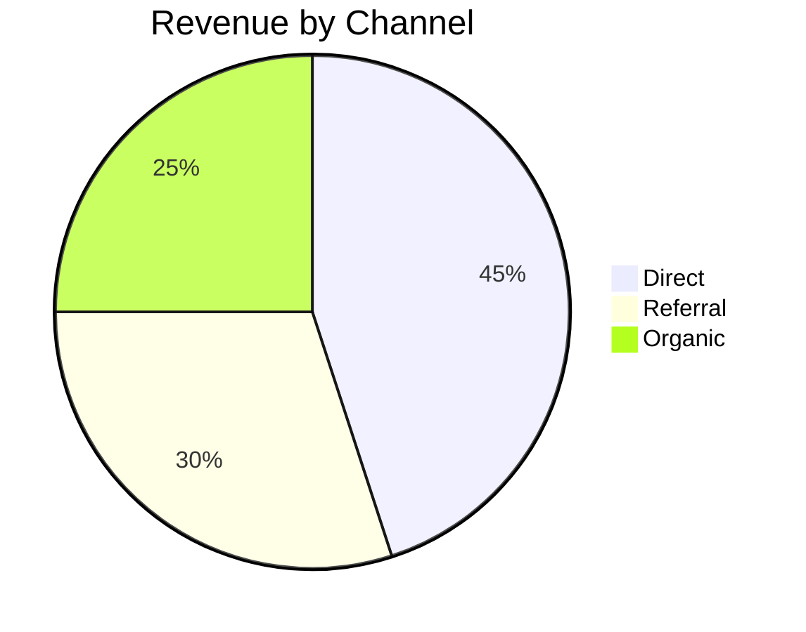

# Canvas Design Skill

You are writing a Canvas — a markdown document rendered with the user's brand
styling. Read this file before calling `write_canvas`. The renderer applies
colors, fonts, and logo automatically — you just write clean markdown.

---

## 1. What You Have

The `code` argument to `write_canvas` is a full **GFM markdown** document:

- Standard markdown: headings, bold, italic, links, lists
- **GFM tables**: `| col | col |` with `---` alignment rows
- **Mermaid diagrams**: fenced code blocks with language `mermaid`
- Horizontal rules (`---`) for section dividers

**Nothing else.** No HTML tags, no JSX, no CSS, no inline styles.

### Branding

The renderer injects the user's brand automatically:
- Headings → brand primary color + brand font
- Table headers → brand primary background, white text
- Blockquote borders, horizontal rules, links → brand primary
- Logo → auto-injected at the top of every document

**Never reference colors, fonts, or the logo in your markdown.** Just write
the content — the styling layer handles the rest.

### Mermaid

Use fenced code blocks with language `mermaid` for diagrams:

~~~markdown

~~~

Supported diagram types: pie, flowchart, sequence, gantt, timeline, mindmap.

---

## 2. Document Recipes

### Invoice / Statement

```markdown
# Invoice #1032

**Date:** March 28, 2026

---

**From:** Your Company Name
**To:** ACME Corp — billing@acme.com

---

| Item | Qty | Rate | Amount |
|------|----:|-----:|-------:|
| Strategy consultation | 2 | $150 | $300 |
| Social media audit | 1 | $500 | $500 |

---

**Subtotal:** $800
**Total: $800**

*Payment due within 30 days.*
```

### Proposal / One-Pager

- Lead with a strong title and one-sentence hook
- Use a horizontal rule after the intro
- Problem/Solution in two short paragraphs
- KPIs as a table: Metric | Value | Note
- Close with a "Next Steps" section

### Report with Charts

- Use Mermaid pie/bar for data visualization
- Use tables for detailed data
- Keep charts simple — one chart per section

### Letter

- Short paragraphs with line breaks between them
- Date at the top
- Recipient block
- Close with a signature line (just the company name in bold)

---

## 3. Hard Rules

1. **Real content only.** No `{{placeholders}}`, TBD, lorem ipsum, or
   "fill in later." If you don't have the details, ask the user first.
2. **No HTML.** Write pure markdown. No `<div>`, `<span>`, `<style>`,
   `<script>`, or any HTML tags.
3. **No color/font references.** Don't write "in blue" or "use Arial."
   The brand styling is automatic.
4. **No image URLs.** The logo is auto-injected. If the user wants an
   image, tell them image embedding isn't supported yet.
5. **No ResponsiveContainer.** For Mermaid charts, keep them simple —
   complex nested charts don't render well.
6. **One document per request.** Never call `write_canvas` twice in
   one turn.
7. **Tables for structured data.** Use GFM tables for anything with
   columns — line items, comparisons, schedules, contact info.

---

## 4. Workflow

1. User asks for a document.
2. Think about which recipe fits (invoice / proposal / report / letter / custom).
3. Pull specifics from the conversation (names, numbers, dates, line items).
4. Call `write_canvas` with a full markdown document.
5. If the user asks for edits, call `patch_canvas` with the full updated
   markdown and the existing `canvas_id` (from the write_canvas response).

---

## 5. When NOT to Use a Canvas

- Plain chat answers ("what's the capital of France")
- Short lists or bullet points inside a chat response
- Code snippets the user is going to paste elsewhere
- Anything the user explicitly asks to be in the chat itself

Use a Canvas when the user says "make me a…", "draft a…", "write up a…",
"put together a…", or when they'd clearly want to export a PDF at the end.
